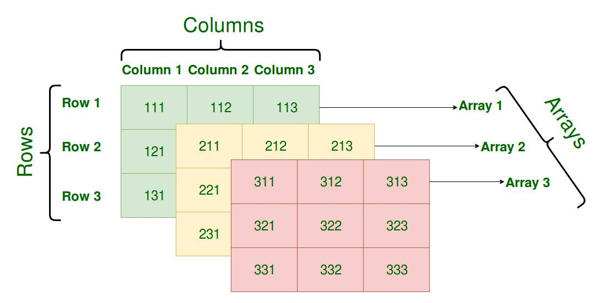

### 概述

> Go数组在初始化之后大小无法改变，存储元素类型相同、大小不同的数组在go看来也是不同的。

```go
// 数组由下面代码进行初始化
func NewArray(elem *Type, bound int64) *Type {
	if bound < 0 {
		Fatalf("NewArray: invalid bound %v", bound)
	}
	t := New(TARRAY)
	t.Extra = &Array{Elem: elem, Bound: bound}
	t.SetNotInHeap(elem.NotInHeap())
	return t
}
```

### 初始化

#### 上限推导

> 使用 `[10]`int类型初始化数组，会在编译期间使用上述代码进行数组初始化
> 
> 使用 `[...]`int类型初始化数组，会使用下面的代码进行推导，数组的长度是通过遍历计算出来的

```go
func typecheckcomplit(n *Node) (res *Node) {
	...
	if n.Right.Op == OTARRAY && n.Right.Left != nil && n.Right.Left.Op == ODDD {
		n.Right.Right = typecheck(n.Right.Right, ctxType)
		if n.Right.Right.Type == nil {
			n.Type = nil
			return n
		}
		elemType := n.Right.Right.Type

		length := typecheckarraylit(elemType, -1, n.List.Slice(), "array literal")

		n.Op = OARRAYLIT
		n.Type = types.NewArray(elemType, length)
		n.Right = nil
		return n
	}
	...

	switch t.Etype {
	case TARRAY:
		typecheckarraylit(t.Elem(), t.NumElem(), n.List.Slice(), "array literal")
		n.Op = OARRAYLIT
		n.Right = nil
	}
}
```

#### 类型转换

> 由字面量组成的数组，根据数组元素数量的不同，编译器会进行优化：
> - 元素数量小于或等于4个时，会直接将数组中的元素放置在栈上
> - 元素数量大于4个时，会将数组中的元素放置在静态区并在运行时取出。会在静态存储区初始化数组的元素，并将临时变量赋值给数组。

#### 访问和赋值

> go会在编译期间对数组访问进行检查，如果存在明显的越界或非法访问，直接编译失败。
> 
> 在运行期间出现访问越界会触发panic退出程序


