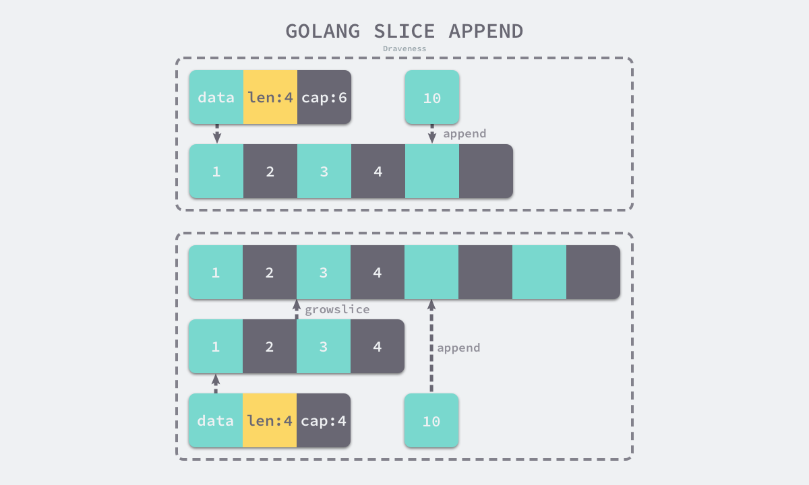
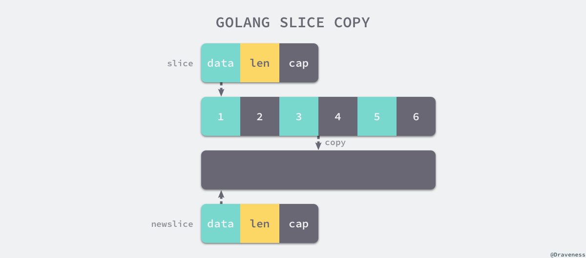

```go
func NewSlice(elem *Type) *Type {
	if t := elem.Cache.slice; t != nil {
		if t.Elem() != elem {
			Fatalf("elem mismatch")
		}
		return t
	}

	t := New(TSLICE)
	t.Extra = Slice{Elem: elem}
	elem.Cache.slice = t
	return t
}
```

### 数据结构
```go
type SliceHeader struct {
	Data uintptr            // 指向数组的指针
	Len  int                // 当前切片的长度
	Cap  int                // 当前切片的容量，即Data数组的大小
}
```


### 初始化

#### 使用下标
```go
package opslicemake

func newSlice() []int {
	arr := [3]int{1, 2, 3}
	slice := arr[0:1]       // 创建切片，底层调用OpSliceMake函数创建切片
	return slice
}
```

#### 字面量

```go
package opslicemake

func test() []int{
    arr := []int{1, 2, 3}
    return arr
}
```

流程如下：
- 根据切片中的元素数量对底层数组的大小进行推断并创建一个数组
- 将字面量元素存储到初始化的数组中
- 创建一个同样指向`[3]int`类型的数组指针
- 将静态存储区的数组`vstat`赋值给`vauto`指针所在的地址
- 通过`[:]`操作获取一个底层使用的`vauto`切片，即使用下标创建切片

#### 关键字

> 使用关键字 `make` 创建切片，在参数校验期间会将 `make` 替换为 `OMAKESLICE`
> 
> 中间代码转换会校验以下参数：
> - 切片的大小和容量
> - 切片是否发生了逃逸
> 
> 当切片发生逃逸或非常大时，运行时需要`runtime.makeslice`在堆上初始化切片，
> 如果不会发生逃逸且切片非常小时，`make([]int,3,4)`会被直接转换为：
> ```go
> var arr [4]int
> n := arr[:3]      // 通过下标获取切片，详见上述下标创建切片
> ```

> 切片占用的内存空间如下：
> 切片大小 = 元素占用大小 * 切片容量
> 
> 使用 `runtime.mallocgc` 申请内存，小于 `32kb` 的对象会在go语言调度器的P结构中直接初始化，否则在堆上初始化


### 追加和扩容



```go
func growslice(et *_type, old slice, cap int) slice {
	newcap := old.cap
	doublecap := newcap + newcap
	if cap > doublecap {
		newcap = cap
	} else {
		if old.len < 1024 {
			newcap = doublecap
		} else {
			for 0 < newcap && newcap < cap {
				newcap += newcap / 4
			}
			if newcap <= 0 {
				newcap = cap
			}
		}
	}
```

扩容逻辑：
- 如果期望容量大于当前容量的两倍就会使用期望容量
- 如果当前切片的长度小于1024就会将容量翻倍
- 如果当前切片的长度大于1024，就会每次增加25%的容量，知道新容量大于期望容量

内存对齐：

> 当数组中的元素所占字节大小为1、8或者2的倍数时，运行时会进行内存对齐，避免内存碎片
> 
> 如果切片中的元素不是指针类型，会将超出len的元素删掉，并且创建新的切片将0-len的元素复制过去，然后再把新的切片赋值给之前的切片

```go
var arr []int64
arr = append(arr, 1, 2, 3, 4, 5)
// 这部分代码会触发内存对齐，期望新容量为5，分配40字节，向上取整到48字节，所以切片的容量为48字节
```

### 拷贝切片



> 调用 `runtime.memmove` 进行内存复制，速度最快，但内存拷贝仍然是非常耗费资源的，谨慎使用
