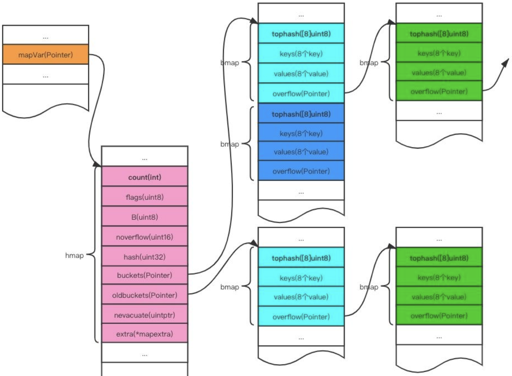
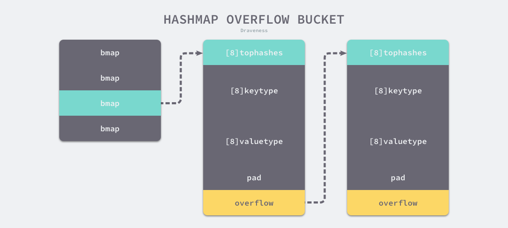
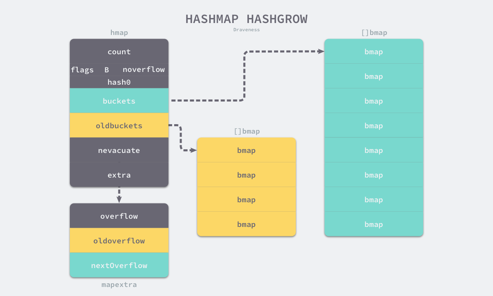
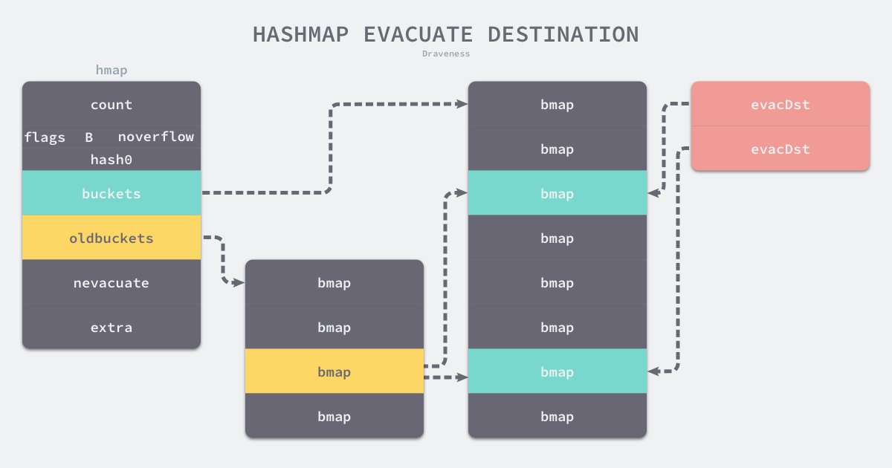
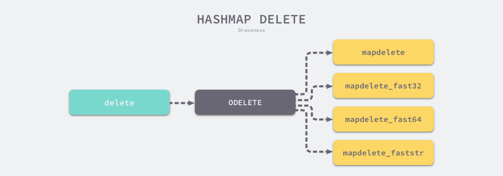

### 设计原理

> 通过hash算法计算出存储位置，实现O(1)的查询效率

#### 哈希函数


> 由上图可以看出，完美的hash函数几乎不存在，总会存在hash冲突问题

可以使用以下方法解决哈希冲突导致的哈希表性能下降问题：

***开放寻址法***


> 将冲突的hash键值对存储在数组中，如果发生冲突，就遍历数组
> 
> 该方法最大的问题就是装载因子，即数组中元素的数量和数组大小的比值，这个值越大，查询效率越低，即趋近于O(n)


***拉链法***


> 拉链法和开放寻址法的区别在于存储hash键值对的数据结构发生了变化，使用链表存储键值对，当超出装载因子时会触发扩容，
> 创建更多的桶降低hash碰撞。在Java中还对链表进行优化，超过一定长度，会将链表改成红黑树，进一步提升查询性能。


### 数据结构


```go
type hmap struct {
	count     int           // 当前哈希表中的元素数量
	flags     uint8 
	B         uint8         // 桶数量，因为哈希表中桶的数量都是2的倍数，所以该字段会存储对数，即len(buckets) = 2 ^ B
	noverflow uint16
	hash0     uint32        // hash种子，为哈希函数的结果引入随机性，在创建哈希表时确定，并在调用哈希函数时作为参数传入
        
	buckets    unsafe.Pointer
	oldbuckets unsafe.Pointer   // 是哈希在扩容时用于保存之前buckets字段，大小为当前buckets的一半
	nevacuate  uintptr

	extra *mapextra
}

type mapextra struct {
	overflow    *[]*bmap
	oldoverflow *[]*bmap
	nextOverflow *bmap
}
type bmap struct {
    tophash [bucketCnt]uint8
	topbits  [8]uint8
    keys     [8]keytype
    values   [8]valuetype
    pad      uintptr
    overflow uintptr
}
```

> 桶使用bmap表示，每个桶最大存储8个键值对，超出后溢出触发扩容
> 
> hash计算是使用tophash实现的，即键的高8位

### 初始化

#### 字面量

```go
hash := map[string]int{
	"1": 2,
	"3": 4,
	"5": 6,
}
```

当键值对数量小于25个时，会直接使用下面代码进行初始化：
```go
hash := make(map[string]int, 3)
hash["1"] = 2
hash["3"] = 4
hash["5"] = 6
```
当键值对数量大于25个时，会直接使用下面代码进行初始化：
```go
hash := make(map[string]int, 26)
vstatk := []string{"1", "2", "3", ... ， "26"}
vstatv := []int{1, 2, 3, ... , 26}
for i := 0; i < len(vstak); i++ {
    hash[vstatk[i]] = vstatv[i]
}
```

#### 运行时

> 使用`make`创建哈希都会调用`runtime.makemap`，会使用以下步骤创建：
> - 计算哈希占用内存是否溢出或者超出能分配的最大值
> - 调用`runtime.fastrand`获取一个随机的哈希种子
> - 根据传入的`hint`计算出需要的最小桶数量
> - 使用`runtime.makeBucketArray`创建用于保存桶的数组
>   - 当创建的桶数量大于2^4个时，会额外创建2 ^ (B - 4) 个溢出桶
>
> 有上述可以看出，正常桶和溢出桶在内存中是连续的


### 读写操作

#### 访问

> 哈希有两种访问方式：
> 
> `v := hash[key]` 只返回值，底层调用 `runtime.mapaccess1`
> 
> `v, ok := hash[key]` 返回值是否存在，底层调用 `runtime.mapaccess2`



> 哈希计算：
> 
> `runtime.mapaccess1`会先通过哈希表设置的哈希函数、种子获取当前键对应的哈希，
> 在通过`runtime.bucketMask` 和 `runtime.add`拿到该键值对所在的桶序号和哈希高位的8位数字。
> 
> 具体计算如下：
> 哈希值的低B位用于计算桶位置，高8位用于确定桶内的位置，确定桶内的位置后再比较key是否相等，因为每个桶只会存储8个键值对，多余的会存储到溢出桶中。

#### 写入



> 首先进行寻址，如果键值对不存在，哈希会为新键值对规划存储的内存地址，
> 通过`runtime.typedmemove`将键移动到对应的内存空间中并返回键对应值的地址val。
> 
> 如果键值对存在，会直接返回目标区域的内存地址，并不会在`runtime.mapassign`
> 这个运行时函数中将值拷贝到桶中，该函数只会返回内存地址，真正的赋值操作是在编译期间插入的。

#### 扩容

> `runtime.mapassign`在以下情况会触发扩容：
> - 装载因子超过了6.5，进行双倍重建
> - 使用了太多的溢出桶，进行等量重建
> 
> loadFactor := count / (2^B)
> 
> go语言扩容不是原子过程，所以每次扩容前需要判断当前是否在扩容，避免二次扩容




> 同时往map中写入和删除数据，由于哈希碰撞导致创建了大量的溢出桶，从而导致缓慢地内存泄露。
> 
> 这种情况会使用`sameSizeGrow`，即重新创建新的桶，将其赋值给buckets，将之前的桶赋值给oldbuckets

***核心有以下函数：***

> - hashGrow：决定扩容方式，以及设置扩容后的map的各个字段
>   - 如果负载因子超载，则会进行双倍重建，当溢出桶的数量过多时，会进行等量重建。新桶会存储到buckets字段，旧桶会存储到oldbuckets字段。extra字段的溢出桶也进行同样的转移

> - growWork：每调用一次growWork函数，都至多会迁移两个桶的数据，一个是目前需要使用的桶，一个是h.nevacuate桶，h.nevacuate记录的是目前至少已经迁移的桶的个数

> - evacuate：真正负责迁移数据的函数，会负责迁移指定桶中的数据，即遍历旧的buckets的bmap数据，将其迁移到新的bmap中
>   - 核心参数：
>     - emptySet = 0：表明该位置及其以后的位置都没有数据
>     - emptyOne = 1：表明该位置没有数据
>     - evacuateX = 2：key/elem是有效的，它在扩容过程中被迁移到了更大表的前半部分
>     - evacuateY = 3：key/elem是有效的，它在扩容过程中被迁移到了更大表的后半部分
>     - evacuatedEmpty = 4：该位置没有数据，且已被扩容
>     - minTopHash = 5：一个被正常填充的topHash的最小值
>   - 判断桶的状态：通过判断topHash[0]是否等于evacuateX、evacuateY或evacuatedEmpty即可，如果等于则说明已经被迁移过
>   - 初始化evacDst结构：等量重建（桶溢出）初始化一个，双倍重建（超过负载）初始化两个。
>       
>   - 旧桶元素分流：桶增加后计算的hashcode取高B位会发生变化，所以最终迁移的位置会发生变化

> - advanceEvacuationMark：收尾工作，增加nevacuate，如果所有的oldbuckets都迁移完成了，会摘除oldbuckets

#### 删除

> 删除操作和查找类似，寻址找到后进行删除，如果删除期间哈希表进行扩容，
> 则需要等待扩容完成后再删除