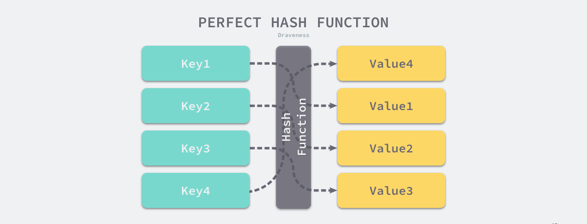
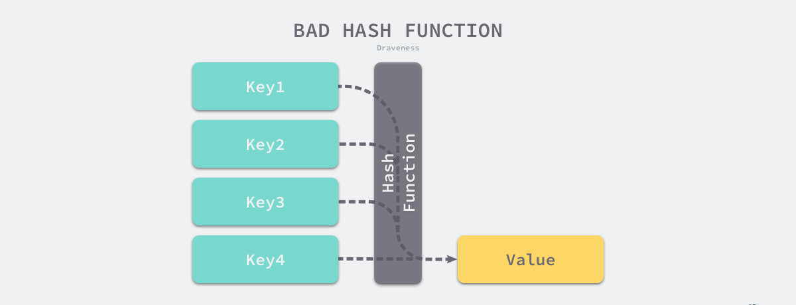
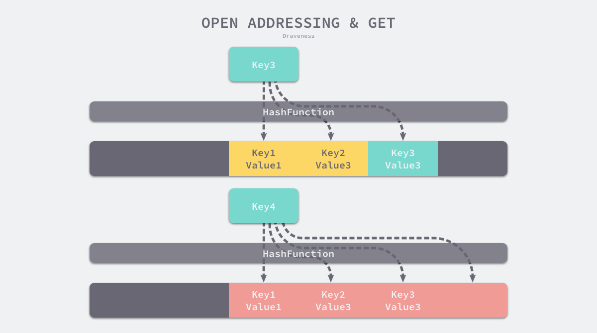
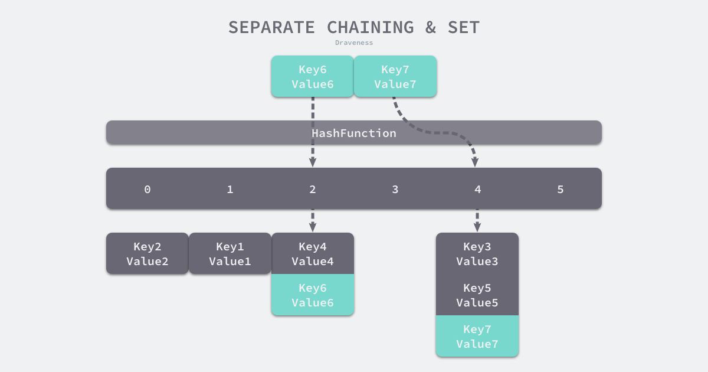
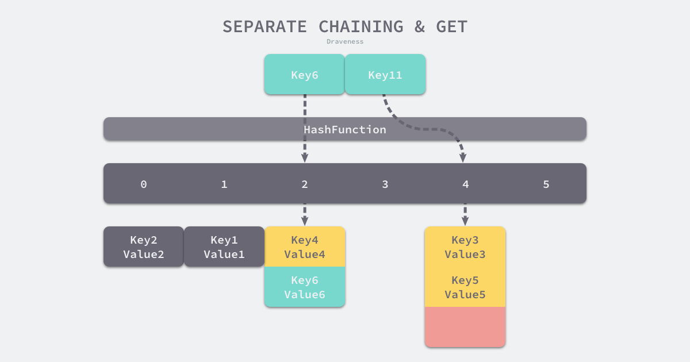
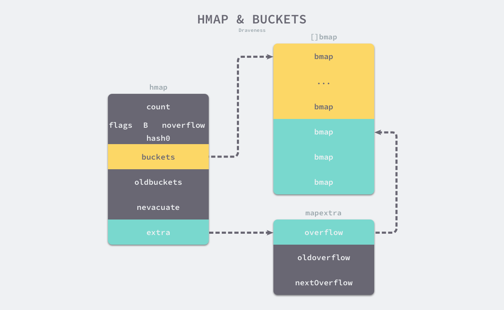

### 设计原理

> 通过hash算法计算出存储位置，实现O(1)的查询效率

#### 哈希函数





> 由上图可以看出，完美的hash函数几乎不存在，总会存在hash冲突问题

可以使用以下方法解决哈希冲突导致的哈希表性能下降问题：

***开放寻址法***




> 将冲突的hash键值对存储在数组中，如果发生冲突，就遍历数组
> 
> 该方法最大的问题就是装载因子，即数组中元素的数量和数组大小的比值，这个值越大，查询效率越低，即趋近于O(n)


***拉链法***




> 拉链法和开放寻址法的区别在于存储hash键值对的数据结构发生了变化，使用链表存储键值对，当超出装载因子时会触发扩容，
> 创建更多的桶降低hash碰撞。在Java中还对链表进行优化，超过一定长度，会将链表改成红黑树，进一步提升查询性能。


### 数据结构



```go
type hmap struct {
	count     int           // 当前哈希表中的元素数量
	flags     uint8 
	B         uint8         // 桶数量，因为哈希表中桶的数量都是2的倍数，所以该字段会存储对数，即len(buckets) = 2 ^ B
	noverflow uint16
	hash0     uint32        // hash种子，为哈希函数的结果引入随机性，在创建哈希表时确定，并在调用哈希函数时作为参数传入
        
	buckets    unsafe.Pointer
	oldbuckets unsafe.Pointer   // 是哈希在扩容时用于保存之前buckets字段，大小为当前buckets的一半
	nevacuate  uintptr

	extra *mapextra
}

type mapextra struct {
	overflow    *[]*bmap
	oldoverflow *[]*bmap
	nextOverflow *bmap
}
type bmap struct {
    tophash [bucketCnt]uint8
	topbits  [8]uint8
    keys     [8]keytype
    values   [8]valuetype
    pad      uintptr
    overflow uintptr
}
```

> 桶使用bmap表示，每个桶最大存储8个键值对，超出后溢出触发扩容
> 
> hash计算是使用tophash实现的，即键的高8位

