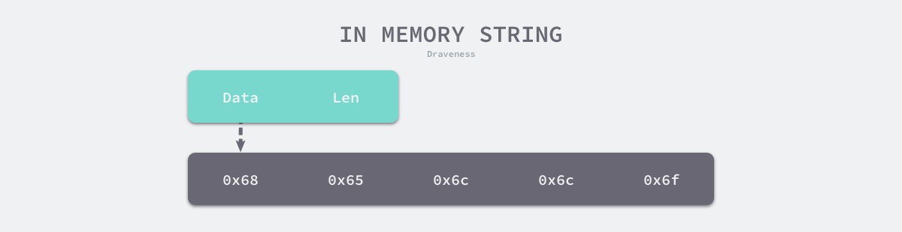
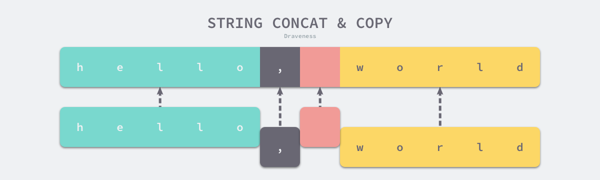
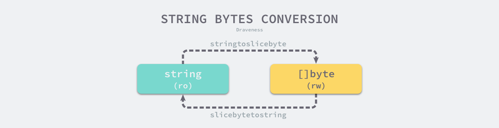

### 数据结构
```go
type StringHeader struct {
	Data uintptr
	Len  int
}
```

### 解析过程

> Go中字符串声明有两种方式
> - 使用双引号(")声明
> - 使用反引号(`)


##### 标准字符串声明（使用双引号）

> 使用标准字符串声明有以下要求：
> - 使用双引号表示开头和结尾
> - 使用反斜杠` \ `来逃逸双引号
> - 不能出现隐式的换行，即不能将一个字符串写在两行


### 拼接



> 字符串拼接会使用函数 `runtime.concatstrings`进行，入参是切片，因为字符串是使用字符数组表示的。

### 类型转换

##### 字节数组转字符串

> 使用函数 `runtime.slicebytetostring`，例如string(bytes)。


##### 字符串转字节数组



> 使用函数 `runtime.stringtoslicebyte`, `func stringtoslicebyte(buf *tmpBuf, s string) []byte`
> 
> 该函数会进行以下处理：
> - 传入的缓冲区不为空，则使用传入的缓冲区
> - 传入的缓冲区为空，则自己创建一个缓冲区
> 
> 然后将数据拷贝过去


### 其他

> 字符串和字节数组的内容一样，但是字符串不可更改，但可以将字符串转成字节数组修改，从而修改字符串


