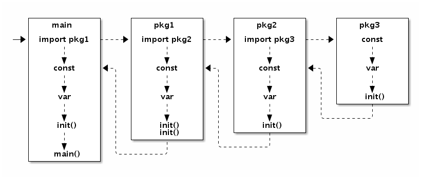

#### goroutine和系统线程

> 每个系统级线程会分配一个栈，用来保存变量和参数，大概2MB，固定栈有以下问题：
> - 需要小栈空间的线程是一种浪费
> - 需要大栈空间的线程有溢出风险

> goroutine会以一个很小的栈启动（2KB或4KB）当栈空间不足时，可以动态伸缩栈的大小

> go调度器采用半抢占式协作调度，只有当前goroutine发生阻塞时才会进行调度
> 
> 在用户态，调度器会根据具体函数保存必要的寄存器，切换代价很低

#### 原子操作

> 可以使用atomic包下的类对基础类型或复杂类型进行原子化操作
> 
> 例如复杂类型可以使用atomic.Value对象

#### 顺序一致性内存模型

> 由于内存屏障的问题可能会导致多个并发任务之间无法观察到公共变量的更新
> 
> 此时就需要使用同步原语解决

#### 初始化顺序

> main函数是运行在一个goroutine中的，如果导入的包中也有init调用了goroutine，则该goroutine是和main函数并发执行的

