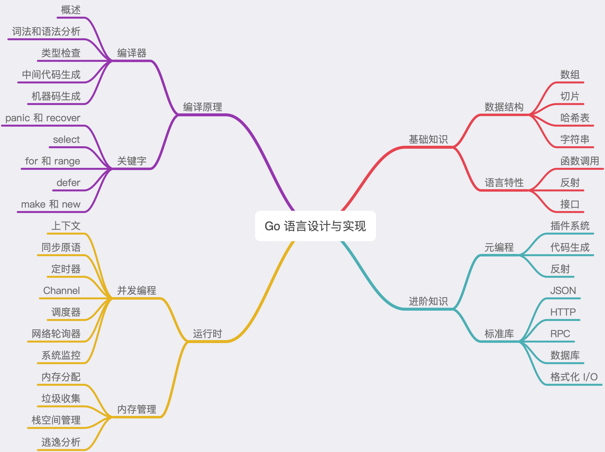
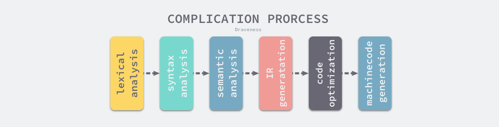
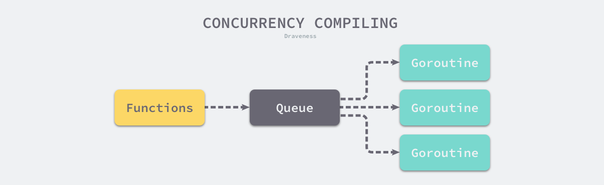
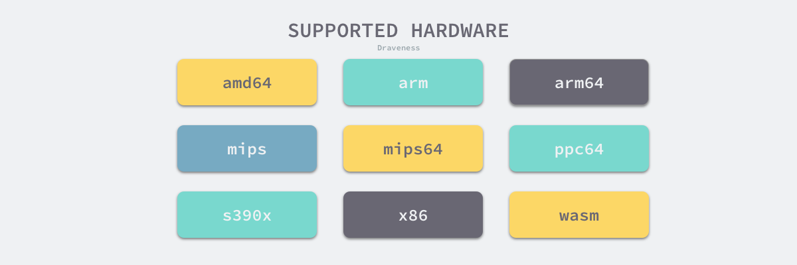

---

## 编译过程

### 预备知识

---

#### 抽象语法树

> 抽象语法树（Abstract Syntax Tree）是源代码语法的结构的一种抽象表示，用树状的方式表示编程语言的语法结构。
> 抽象语法树中的每一个节点都表示源代码中的一个元素，每一棵子树都表示一个语法元素。
> 如下图所示：

#### 静态单赋值

> 静态单赋值（Static Single Assignment）是中间代码的特性，如果中间代码具有静态单赋值的特性，那么每个变量都只会被赋值一次。
> 
> 例如：
> x := 1，
> x := 2，
> y := 3
> 
> 上面代码可以看出x被赋值了两次，第二次的结果覆盖了第一次，且覆盖之前无其他操作，所以第一步可以被优化掉，不需要执行

#### 指令集

> 不同的指令环境下编译的代码可能无法运行，例如在arm环境下编译的在x86环境下无法运行，要在编译时指定运行环境的指令集

---

### 编译原理

#### 词法和语法分析

---

##### 词法分析

> 解析源代码，将源代码解析为`token`序列，供后面的语法分析器使用，解析源代码会使用到词法分析器。

##### 语法分析器

> 语法分析的输入是词法分析生成的token序列，按照go语言定义好的语法规约进行解析，然后生成一个SourceFile结构，即AST

> 每一个go文件会对应一个AST

##### 类型检查

> 编译器会对语法树中定义和是用的类型进行检查，类型检查会按照以下的顺序验证和处理不同类型的节点：
- 常量、类型和函数名及类型
- 变量的赋值和初始化
- 函数和闭包的主体
- 哈希键值对的类型
- 导入函数体
- 外部的声明

> 遍历语法树的时候，会对每个子树的类型进行验证，所有类型错误和不匹配都会被暴露出来，其中包括结构体对接口的实现
> 
> 还会展开和改写一些内建的函数，例如`make`在该阶段会根据子树的结构被替换成`runtime.makeslice`或`runtime.makechan`等函数

##### 中间代码生成

> 使用`cmd/compile/internal/gc.compileFunctions`编译go函数，所有待编译的函数会放入到队列中，然后启动多个goroutine进行消费
> 
> 会在该阶段对代码进行优化，因为go使用了SSA特性

##### 机器码生成

### 编译器入口

---

> go编译器入口在`src/cmd/compile/internal/gc/main.go`，其中`gc.Main`就是编译主程序，该函数会先获取命令传入的参数并更新编译选项和配置，
> 随后会调用`cmd/compile/internal/gc.parseFiles`对输入的文件进行词法和语法分析得到对应的抽象语法树：
> 
> 抽象语法树会经历下面的阶段：
- 检查变量、类型和函数的类型
- 处理变量的赋值
- 对函数的主体进行类型检查
- 决定如何捕获变量
- 检查内联函数的类型
- 进行逃逸分析
- 将闭包的主体转换成引用的捕获变量
- 编译顶层函数
- 检查外部依赖的声明

