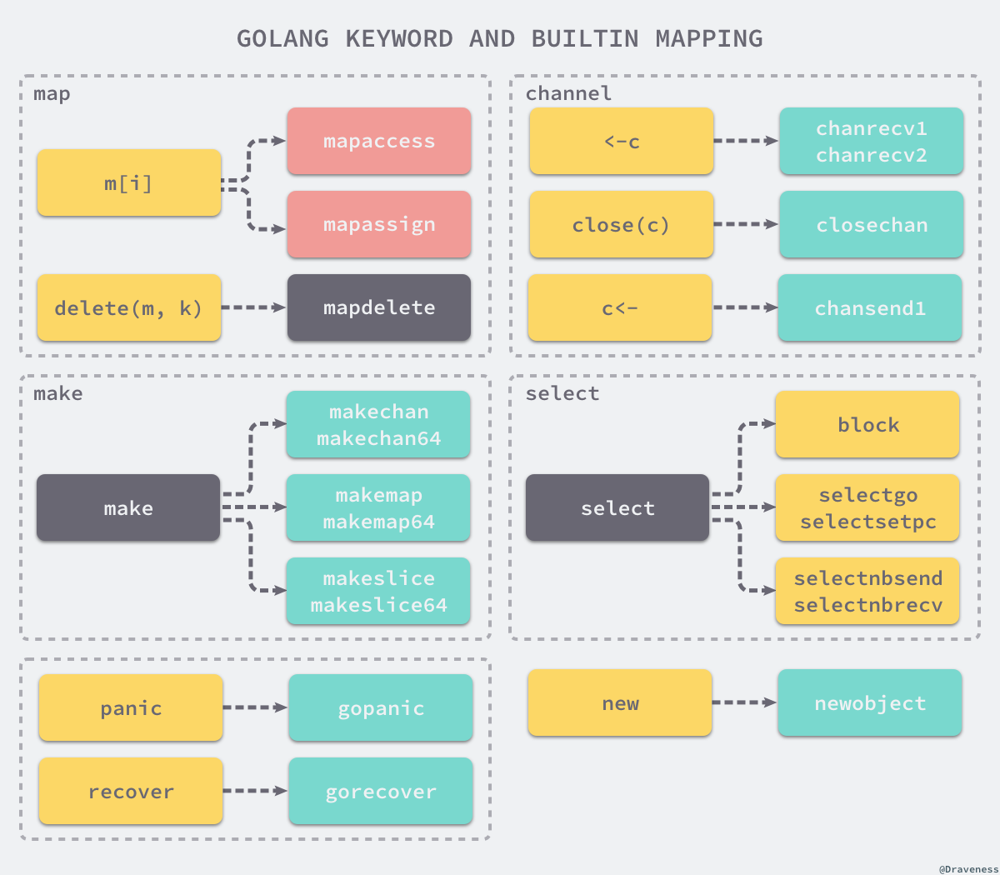

### 概述

> 中间代码是编译器或者虚拟机使用的语言，可以帮助分析计算机程序。
> 编译过程中编译器会将源代码转换成中间代码，然后再将中间代码转换成机器码。

**使用中间代码的原因有以下：**
- 需要编译多种类型的机器码
- 需要在中间类型对代码做优化

### 配置初始化

> SSA配置的初始化过程是中间代码生成之前的准备工作，在改过程中，会缓存可能用到的类型指针、初始化SSA配置和一些之后会调用的运行时函数。

### 遍历和替换

> 遍历抽象语法树是将部分关键词替换为函数调用

### SSA生成

> 遍历和替换之后，抽象语法树就不会再变了，然后将抽象语法树转换成中间代码。
> 
> 然后进行SSA，对代码进行优化，生成最终的中间代码。